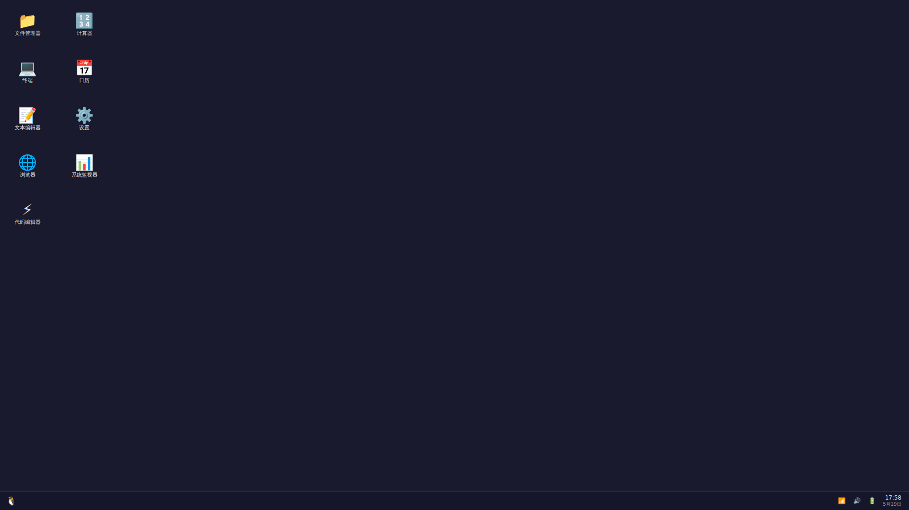

WebLinuxOS
==========

A fully functional Linux-style desktop environment running entirely in the browser.



**[Live Demo](https://saya-ch.github.io/WebLinuxOS/)**

---

Features
--------

### Desktop Environment

- **Window Management**: Drag, resize, minimize, maximize, snap-to-edge, multi-window layering with z-index management
- **Virtual File System**: Full file operations (create, delete, rename, copy, move) with localStorage persistence
- **Terminal**: 150+ commands with history, auto-completion, aliases, and ANSI color support
- **Multi-workspace**: Up to 9 virtual desktops with keyboard navigation (`Ctrl+Alt+1-9`)
- **Global Search**: Instant search across applications, files, and commands (`Ctrl+K`)
- **Theme System**: Dark/light mode with smooth transitions and CSS variable theming
- **Desktop Widgets**: Clock, weather, system monitor, focus timer, air quality, daily poem

### Built-in Applications

| Category | Applications |
|----------|--------------|
| **Development** | Terminal, Code Editor, Code Runner, JSON Formatter, JWT Decoder, Regex Tester, UUID Generator, Hash Generator, API Tester |
| **Productivity** | File Manager, Text Editor, Notes, Calendar, Calculator, Todo List, Pomodoro, Clipboard Manager |
| **Utilities** | Weather, System Monitor, Disk Utility, Network Monitor, Password Manager, QR Generator, Unit Converter, Currency Converter |
| **Entertainment** | Music Player, Video Player, Image Viewer, Games (Snake, Tetris, 2048, Memory) |
| **Data** | Live Dashboard, Cryptocurrency Tracker, News Reader, WorldPulse, GitHub Explorer |

### Real-time API Integration

- **Weather**: Open-Meteo API with 7-day forecasts and hourly predictions
- **Air Quality**: AQI data from Open-Meteo
- **Cryptocurrency**: Real-time prices from CoinGecko
- **Exchange Rates**: Live currency conversion from open.er-api.com
- **ISS Tracking**: Real-time space station position
- **Hacker News**: Top technology stories
- **GitHub**: Repository and user information
- **Translation**: Multi-language translation via MyMemory

Getting Started
---------------

### Quick Start

Visit the [live demo](https://saya-ch.github.io/WebLinuxOS/) to start using WebLinuxOS immediately.

### Keyboard Shortcuts

| Shortcut | Action |
|----------|--------|
| `Ctrl + K` | Global search |
| `Ctrl + T` | Open terminal |
| `Ctrl + E` | Open file manager |
| `Ctrl + B` | Open browser |
| `Ctrl + Q` | Close window |
| `Ctrl + M` | Minimize window |
| `Alt + Tab` | Cycle windows |
| `Ctrl + Alt + 1-9` | Switch workspace |
| `Ctrl + Alt + ArrowLeft/Right` | Switch workspace |
| `F11` | Fullscreen |

### Local Development

```bash
git clone https://github.com/saya-ch/WebLinuxOS.git
cd WebLinuxOS/web-linux
npm install
npm run dev
```

Open http://localhost:5173/WebLinuxOS/ in your browser.

### Build for Production

```bash
npm run build
npm run preview
```

Terminal Commands
-----------------

WebLinuxOS includes over 150 terminal commands. Here are some highlights:

```bash
# System
whoami          # Current user
hostname        # System hostname
uname           # System details
date            # Current date and time
uptime          # System uptime
clear           # Clear terminal

# File Operations
ls [options]    # List directory contents
cd <path>       # Change directory
pwd             # Print working directory
cat <file>      # Display file contents
touch <file>    # Create empty file
mkdir <dir>     # Create directory
rm <path>       # Remove file/directory
cp <src> <dest> # Copy files
mv <src> <dest> # Move files
find <path>     # Search for files
grep <pattern>  # Search text in files

# Network & APIs
weather [city]          # Get real-time weather
crypto                  # Cryptocurrency prices
news                    # Hacker News top stories
translate <lang> <text> # Translate text
github <repo>           # GitHub repository info
ipinfo                  # IP information
timezone <city>         # Timezone lookup

# Development Tools
json                    # JSON formatter
base64                  # Base64 encode/decode
hash                    # Generate SHA hashes
uuid                    # Generate UUIDs
regex                   # Test regular expressions
jwt                     # JWT decoder
calc <expression>       # Calculator
timestamp               # Convert timestamps

# System
open <app>              # Open application
system-status           # System metrics
worldpulse              # Open global dashboard

# Help
help                    # View complete command list
man <command>           # Command manual
```

Tech Stack
----------

- **React 19** - UI framework
- **TypeScript** - Type safety
- **Vite 8** - Build tool
- **Zustand 5** - State management
- **Lucide React** - Icons
- **Marked** - Markdown parsing
- **Pyodide** - Python runtime (optional)

Project Structure
-----------------

```
web-linux/
├── src/
│   ├── apps/              # Application components
│   │   ├── terminal/      # Terminal command system
│   │   ├── Terminal.tsx   # Terminal UI
│   │   ├── FileManager.tsx
│   │   └── ...
│   ├── components/
│   │   ├── desktop/       # Core desktop components
│   │   │   ├── Window.tsx
│   │   │   ├── WindowManager.tsx
│   │   │   ├── Desktop.tsx
│   │   │   ├── Taskbar.tsx
│   │   │   └── StartMenu.tsx
│   │   └── ...
│   ├── store.tsx          # Zustand global state
│   ├── store/
│   │   ├── fileUtils.ts   # File system utilities
│   │   └── storageUtils.ts # Local storage utilities
│   ├── apps.tsx           # Application registry
│   ├── App.tsx            # Application entry
│   └── utils/
│       └── apiCache.ts    # API caching
├── public/                # Static assets
├── index.html
├── vite.config.ts
└── package.json
```

Design Principles
-----------------

1. **Performance First**: Component lazy loading, code splitting, and efficient rendering
2. **Data Privacy**: Most tools operate locally with zero network requests
3. **Persistence**: User data persists across sessions via localStorage
4. **Extensible**: Easy to add new applications and terminal commands
5. **Themeable**: CSS variable-driven theming for dark/light modes
6. **Accessibility**: Keyboard navigation and screen reader support

Browser Support
---------------

- Chrome 110+
- Firefox 115+
- Safari 16+
- Edge 110+

Contributing
------------

Contributions are welcome. Please follow these steps:

1. Fork the repository
2. Create a feature branch: `git checkout -b feature/your-feature`
3. Commit changes with descriptive messages
4. Push to your fork: `git push origin feature/your-feature`
5. Open a Pull Request

Before submitting, run these checks:

```bash
npm run typecheck   # TypeScript type checking
npm run lint        # ESLint checking
npm run build       # Production build verification
```

### Adding Applications

1. Create your component in `src/apps/`
2. Register it in `src/apps.tsx` with a unique ID
3. Add lazy loading mapping in `src/components/desktop/WindowManager.tsx`

### Adding Terminal Commands

1. Create or modify command files in `src/apps/terminal/`
2. Register using the `registerCommand` function
3. Import in `src/apps/terminal/index.ts`

License
-------

This project is licensed under the MIT License.

Acknowledgements
----------------

Thanks to the following open source projects and services:

- React, TypeScript, Vite, Zustand
- Lucide Icons, Marked
- Open-Meteo, CoinGecko, Hacker News API, GitHub API
- wheretheiss.at, open.er-api.com, MyMemory

Changelog
---------

### v34.0.0

- Enhanced System Monitor with real-time browser performance API integration
- Added toggle between real and simulated data modes
- Improved chart visualization with SVG-based graphs and gradient fills
- Enhanced hover effects and animations throughout the UI
- Code quality improvements with useMemo and useCallback optimizations
- Fixed potential memory leaks with proper cleanup in useEffect hooks
- Updated README with improved structure and documentation
- Enhanced terminal with better ANSI color support
- Improved window management with smoother animations

### v33.1.0

- Enhanced terminal API commands: Added `news`, `currency`, `crypto`, `translate`, `timezone`, `ipinfo`, `qr`, `password`, `uuid`, `timestamp` commands
- News API integration with multiple categories
- Currency exchange API with real-time rates
- Cryptocurrency tracking from CoinGecko
- Multi-language translation via MyMemory API
- Timezone lookup with WorldTimeAPI
- IP information from ipapi.co
- QR code generation via qrserver.com
- Password and UUID generation utilities
- Timestamp converter

### v32.1.0

- Enhanced Web Browser with page zoom and favicon display
- Fixed icon import issues with unified management
- Optimized file system utilities with improved caching
- Improved terminal command system
- Enhanced system monitoring interface
- Code quality improvements with TypeScript fixes

### v31.0.0

- Added intelligent developer workbench
- Code template library with search and filtering
- API Mock service with visual simulator
- Knowledge graph with connection visualization
- Intelligent code analysis with quality metrics
- Cyberpunk tech-style UI design
- Responsive layout optimization