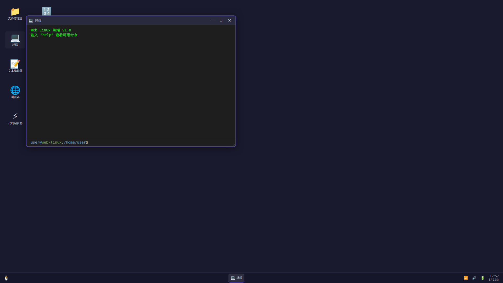
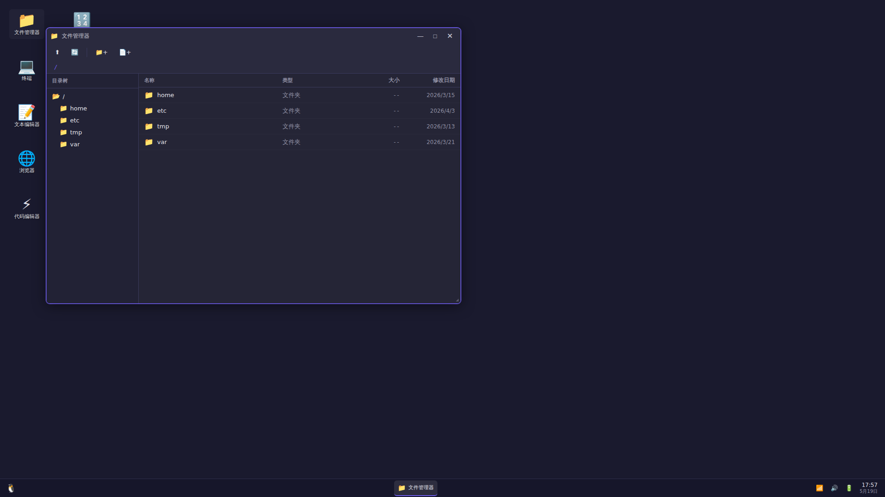

<div align="center">

# WebLinuxOS

**浏览器中完整运行的Linux桌面环境**

无需安装 · 无需后端 · 即开即用 · 完全免费

[在线体验](https://saya-ch.github.io/WebLinuxOS/) · [报告问题](https://github.com/saya-ch/WebLinuxOS/issues) · [功能建议](https://github.com/saya-ch/WebLinuxOS/issues)

[](LICENSE)
[](https://react.dev)
[](https://www.typescriptlang.org)
[](https://vite.dev)
[](https://zustand-demo.pmnd.rs)

</div>

<p align="center">
  
</p>

<p align="center">
  
  
</p>

---

## 项目特色

WebLinuxOS 在浏览器中提供完整的 Linux 桌面体验，100% 客户端运行：

### 核心能力

- **240+ 内置应用** — 生产力、开发、媒体、系统管理全覆盖
- **150+ 终端命令** — 文件操作、网络工具、系统监控、实时 API
- **虚拟文件系统** — 持久化存储，支持撤销/重做
- **实时 API 集成** — 天气、新闻、加密货币、GitHub、翻译等
- **Python 运行时** — 通过 Pyodide 在浏览器中运行 Python 3
- **零配置启动** — 现代浏览器打开即用，无需任何安装

### 与众不同

- **完全离线可用** — 核心功能无需网络连接
- **零服务器成本** — 纯静态部署，无后端依赖
- **零 API 密钥** — 所有核心功能开箱即用
- **跨平台兼容** — Windows、macOS、Linux、移动端通用
- **数据本地化** — 所有数据存储在浏览器本地，隐私安全

---

## 核心功能

### 窗口管理

- 拖拽、调整大小、最小化、最大化、窗口贴边
- 多显示器风格的平铺和窗口堆叠
- 最多 9 个虚拟桌面，支持键盘快捷键切换
- 任务栏、Dock 和系统托盘，实时状态指示
- 窗口分组和键盘导航 (`Alt+Tab`)
- 流畅的窗口动画和过渡效果

### 虚拟文件系统

- 创建、删除、重命名、复制、移动文件和文件夹
- 所有文件操作支持撤销/重做
- 基于 localStorage 的持久化存储
- 完整的路径解析、权限和目录导航
- 文件搜索和最近文件快速访问
- 文件类型检测和图标关联

### 终端模拟器

- **150+ 内置命令**，涵盖文件操作、网络工具、系统监控、实用工具
- **管道 (`|`)**、重定向 (`>` `>>` `<`)、链式操作 (`;` `&&` `||`)
- **后台进程** (`&`)、`jobs`、`kill` 管理
- **Tab 补全**、命令历史、反向搜索 (`Ctrl+R`)
- **Python 运行时** — 通过 Pyodide 直接运行 Python 3
- **实时命令**: `weather`、`news`、`crypto`、`github`、`calendar`、`battery`、`cpu`、`neofetch`
- **网络命令**: `ping`、`traceroute`、`dig`、`curl`、`wget`、`netstat`
- **系统命令**: `top`、`ps`、`df`、`free`、`uptime`、`whoami`、`date`

### 实时 API 集成

所有集成都使用免费公共端点，无需 API 密钥：

| 类别 | 服务 | API |
|------|------|-----|
| 天气 | 全球天气、天气预报 | Open-Meteo |
| 新闻 | Hacker News 热门文章 | Hacker News API |
| 金融 | 加密货币、汇率 | CoinGecko、Frankfurter |
| 开发 | GitHub 仓库 | GitHub REST API |
| 地理 | IP 定位、国家信息 | ipapi、REST Countries |
| 翻译 | 多语言翻译 | MyMemory |
| 知识 | Wikipedia 文章 | Wikipedia REST API |
| 实用 | 随机名言、笑话、建议 | Quotable、JokeAPI、Advice Slip |

### 桌面增强

- **动态壁纸系统** — 粒子、网络、波浪、星云、极光(Aurora)等效果，支持鼠标交互
- **Aurora 动态壁纸** — 基于 Canvas 的极光效果，含粒子系统、星空、性能自适应
- **桌面小部件** — 时钟、系统脉搏、天气、番茄钟、便利贴
- **通知系统** — 支持优先级和可关闭提醒
- **命令面板** — 快速访问所有应用和命令
- **智能命令中心** — 统一快速启动 + 搜索 + 计算 + 命令入口 (`Cmd/Ctrl+Space`)
- **工作区管理器** — 保存/恢复桌面布局、窗口状态和文件系统快照
- **全局搜索** — 搜索文件、应用和设置
- **明暗主题** — 支持自定义强调色
- **启动画面** — 带加载动画的欢迎界面

### Web 浏览器（增强版）

- 内置 Wikipedia 搜索（中文 + 英文）
- Hacker News 阅读器，5 个分类
- GitHub 仓库浏览器
- 智能 URL 路由（`wiki:`、`hn:`、`gh:` 前缀）
- 标签系统，支持书签和历史记录
- 内置搜索引擎

### 开发工具

- **WebIDE Pro** — 全功能在线编程环境，支持代码补全
- **代码编辑器** — 支持 30+ 语言语法高亮
- **在线代码运行器 Pro** — 多语言执行，支持 JavaScript/TypeScript 即时运行
- **代码游乐场**、**CodeSandbox**、**CodeStudio**
- **代码格式化**、**差异对比**、**代码审查**
- **CodeShare** — 代码片段分享，语法高亮、差异对比、模板库、Markdown 导出
- **API 测试器**、**REST 客户端** — 测试和调试 API
- **正则构建器**、**JSON 格式化**、**JSON Schema 验证**
- **JWT 解码器** — 解码和检查 JWT 令牌
- **HTTP 状态码浏览器** — 查询 HTTP 状态码

### 生产力套件

- **Markdown 编辑器** — 实时预览、幻灯片、HTML 导出
- **电子表格** — 公式、图表、数据分析
- **日历** — 事件管理，支持提醒
- **世界时钟** — 多时区显示
- **任务管理** — 看板、项目规划、甘特图
- **番茄钟** — 专注时段，统计分析
- **习惯追踪器** — 追踪每日习惯和连续天数
- **智能笔记** — 标签、颜色、导入/导出
- **思维导图** — 可视化脑暴
- **演示文稿** — 幻灯片过渡效果

### 创意和媒体

- **画图** — 基础绘图工具
- **DrawPad** — 完整绘图应用，图层、形状、文本、PNG 导出
- **音乐播放器** — 音频播放，均衡器
- **音乐工作室** — 作曲和编辑
- **音乐可视化** — 实时音频可视化
- **视频播放器** — HTML5 视频播放
- **图片查看器** — 支持多种格式
- **屏幕录制** — 录制浏览器屏幕
- **截图工具** — 截取和标注截图

### 系统和实用工具

- **文件管理器** — 双面板导航、搜索、批量操作
- **系统监控** — CPU、内存、网络使用率
- **进程管理器** — 查看和管理运行进程
- **网络监控** — 实时带宽使用率
- **速度测试** — 测量网络速度
- **DNS 查询** — 域名解析
- **计算器** — 基础和科学计算
- **密码管理器** — 安全密码存储
- **二维码生成器** — 为 URL 和文本创建二维码
- **颜色选择器** — HEX、RGB、HSL 值
- **单位转换器** — 货币、长度、重量、温度
- **剪贴板管理器** — 剪贴板历史

---

## 技术栈

| 层级 | 技术 |
|------|------|
| UI 框架 | React 19 |
| 语言 | TypeScript 6 |
| 构建工具 | Vite 8 |
| 状态管理 | Zustand 5 |
| Python 运行时 | Pyodide 0.26 |
| 图标 | Lucide React |
| 代码编辑器 | Monaco Editor（通过 Pyodide） |
| 存储 | localStorage |

---

## 快速开始

### 系统要求

- Node.js 18+
- npm

### 安装和运行

```bash
git clone https://github.com/saya-ch/WebLinuxOS.git
cd WebLinuxOS/web-linux
npm install
npm run dev
```

打开浏览器访问 `http://localhost:5173`。

### 生产构建

```bash
npm run build
```

构建产物在 `web-linux/dist/`，可部署到任何静态主机。

### 可选 API 密钥

在 `web-linux/` 目录创建 `.env` 文件以获得增强功能：

```env
VITE_OPENWEATHERMAP_API_KEY=your_key
VITE_NEWSAPI_KEY=your_key
VITE_EXCHANGERATE_API_KEY=your_key
VITE_NASA_API_KEY=your_key
```

所有核心功能无需 API 密钥即可正常使用。

---

## 键盘快捷键

| 快捷键 | 功能 |
|--------|------|
| `Ctrl/⌘ + Space` | 智能命令中心 |
| `Ctrl/⌘ + Shift + L` | 打开应用启动器 |
| `Ctrl + Shift + T` | 打开终端 |
| `Ctrl + E` | 打开文件管理器 |
| `Ctrl + ,` | 打开设置 |
| `Ctrl + K` | 全局搜索 |
| `Ctrl + P` | 命令面板 |
| `Ctrl + Shift + C` | 打开计算器 |
| `Ctrl + Q` | 关闭聚焦窗口 |
| `Ctrl + M` | 最小化聚焦窗口 |
| `Alt + Tab` | 切换窗口 |
| `Ctrl + 1-9` | 切换到桌面 N |
| `Ctrl + Shift + 1-9` | 移动窗口到桌面 N |
| `F11` | 切换全屏 |

**终端快捷键**: `Ctrl+L` 清屏 · `Ctrl+C` 中断 · `Ctrl+R` 反向搜索 · `Tab` 自动补全

---

## 项目结构

```
WebLinuxOS/
└── web-linux/
    ├── src/
    │   ├── App.tsx                 # 根组件，键盘快捷键
    │   ├── apps.tsx                # 应用注册表（240+ 应用）
    │   ├── store.tsx               # Zustand 全局状态
    │   ├── types.ts                # TypeScript 类型定义
    │   ├── icons.tsx               # 图标组件
    │   ├── components/
    │   │   ├── desktop/            # 窗口管理器、任务栏、Dock、桌面
    │   │   ├── CommandPalette.tsx
    │   │   ├── NotificationSystem.tsx
    │   │   └── ...
    │   ├── apps/                   # 应用实现
    │   │   ├── terminal/           # 终端模拟器和命令
    │   │   ├── CodeEditor.tsx
    │   │   ├── FileManager.tsx
    │   │   └── ...
    │   ├── services/               # API 客户端（aiService、apiService）
    │   ├── store/                  # 虚拟文件系统、持久化工具
    │   ├── utils/                  # 辅助函数
    │   └── styles/                 # 主题样式表
    ├── screenshots/                # 项目截图
    ├── index.html
    ├── vite.config.ts
    └── package.json
```

---

## 部署

### GitHub Pages（自动）

推送到 `main` 分支 — GitHub Actions 自动构建并部署。

### 静态托管

上传 `web-linux/dist/` 到任何静态主机（Vercel、Netlify、Cloudflare Pages、S3、nginx）。

---

## 贡献指南

欢迎贡献代码！

1. Fork 本仓库
2. 创建功能分支: `git checkout -b feature/my-feature`
3. 进行更改
4. 验证: `npm run typecheck && npm run build`
5. 提交 Pull Request

**添加新应用:**

1. 在 `web-linux/src/apps/` 创建组件
2. 在 `web-linux/src/apps.tsx` 注册
3. 在 `web-linux/src/components/desktop/WindowManager.tsx` 添加懒加载导入

---

## 浏览器支持

| 浏览器 | 版本 |
|--------|------|
| Chrome | 90+ |
| Firefox | 88+ |
| Safari | 14+ |
| Edge | 90+ |

---

## 开源协议

[MIT](LICENSE) — 免费使用、修改和分发，包括商业用途。

## 致谢

- 窗口管理器、终端和虚拟文件系统为原创实现
- 灵感来源: [linux.js](https://github.com/hrtowii/linux.js)、[WebSH](https://github.com/nicedoc/web-sh)
- 壁纸来自 Unsplash 和 Pexels（CC0）

---

## 更新日志

### v38.1.0 (2025-01-XX)

**新增功能**

- 在线代码运行器 Pro — 支持 JavaScript/TypeScript 即时运行，HTML 实时预览
- 多文件管理，支持切换和编辑
- 代码模板库，包含各语言示例代码

**改进优化**

- 优化应用启动性能
- 改进内存使用效率
- 增强错误处理和用户提示

---

<div align="center">

**[在线体验](https://saya-ch.github.io/WebLinuxOS/)** · 由 React 19 + TypeScript 6 + Vite 8 强力驱动

</div>