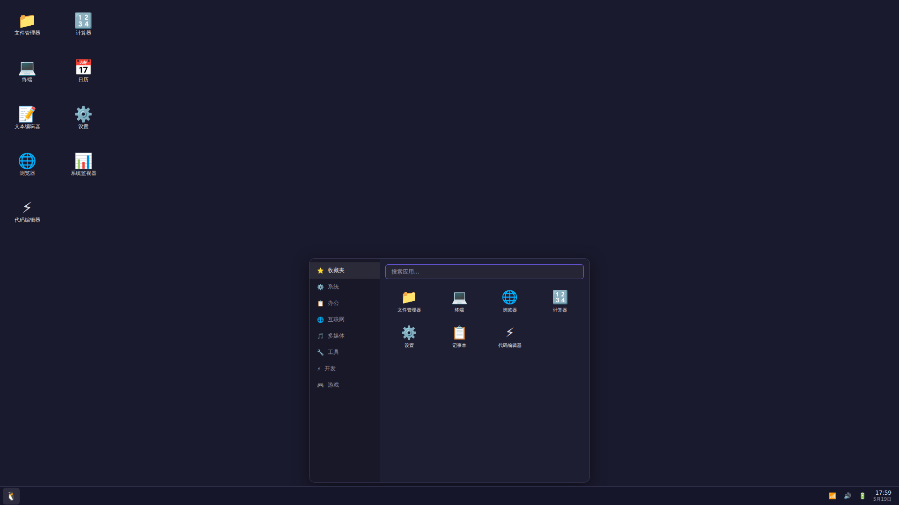
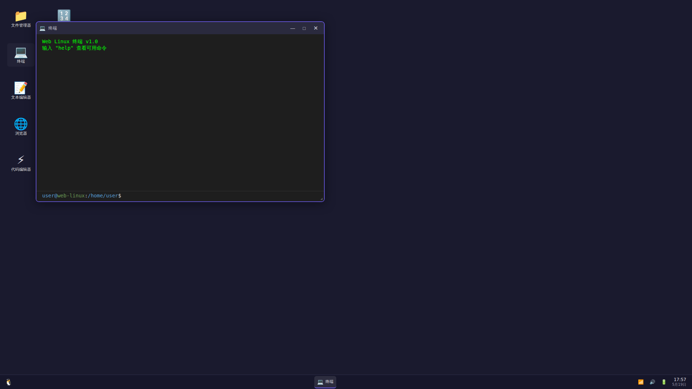
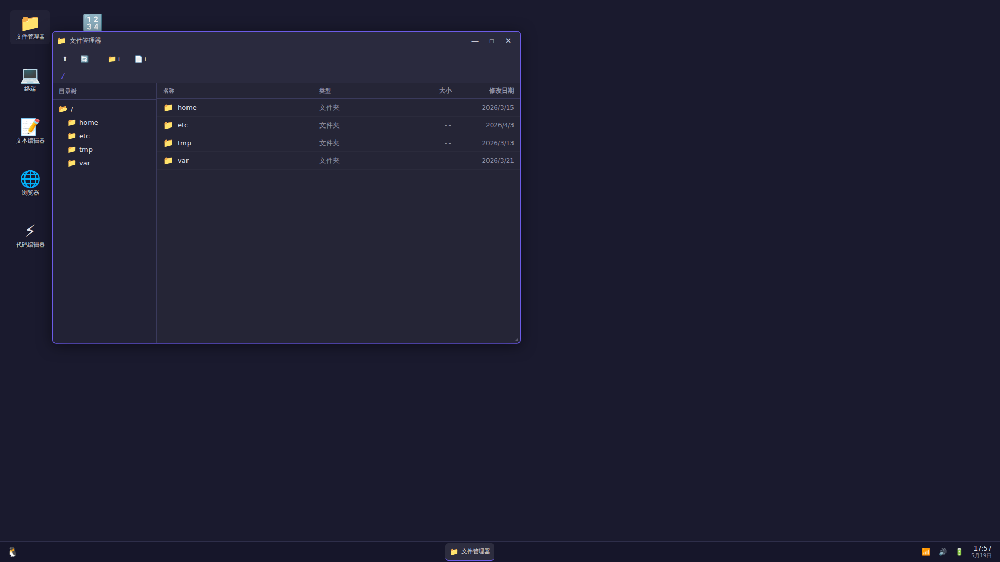
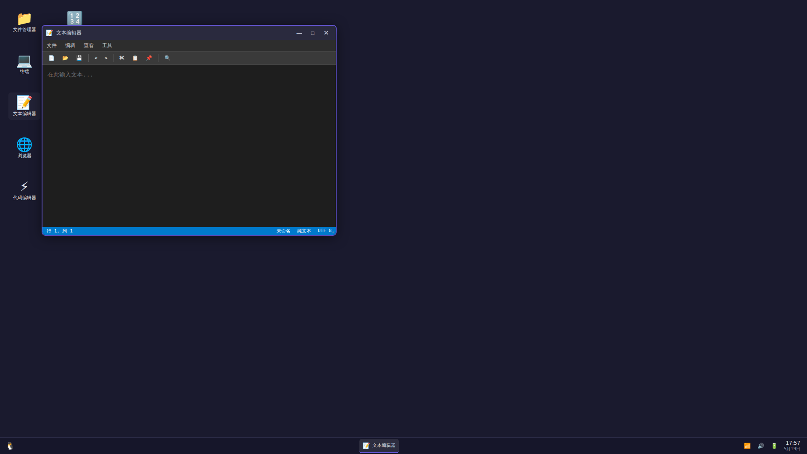

<div align="center">

# WebLinuxOS

**浏览器中的完整 Linux 桌面环境 — 真实工具，真实工作，零安装。**

[在线体验](https://saya-ch.github.io/WebLinuxOS/) · [文档](https://github.com/saya-ch/WebLinuxOS/wiki) · [更新日志](CHANGELOG.md) · [提交问题](https://github.com/saya-ch/WebLinuxOS/issues) · [功能建议](https://github.com/saya-ch/WebLinuxOS/issues)

[](https://github.com/saya-ch/WebLinuxOS/stargazers)
[](LICENSE)
[](https://github.com/saya-ch/WebLinuxOS/releases)
[](https://saya-ch.github.io/WebLinuxOS/)
[](https://www.typescriptlang.org/)
[](https://react.dev/)
[](https://vitejs.dev/)

</div>

---

## 项目简介

WebLinuxOS 是一个完全运行在浏览器中的 Linux 桌面环境。它不是模拟器或演示项目——每一个应用都提供真实的功能：终端执行真实命令，代码编辑器编写真实代码，API 测试器发送真实请求，AI 图像工作室通过公开 API 生成真实图像，隐私工具在本地检测真实敏感信息。基于 React 19 和 TypeScript 构建，内置 400+ 应用，覆盖开发、办公、网络、多媒体、AI 和游戏等领域，将任何拥有浏览器的设备变成完整的工作站。

WebLinuxOS is a complete Linux desktop environment that runs entirely in the browser. It is not a simulator or demo project — every app provides real functionality: the terminal executes real commands, the code editor writes real code, the API tester sends real requests, the AI studio generates real images via public APIs, and the privacy tools detect real sensitive information locally. Built with React 19 and TypeScript, it ships with 400+ apps covering development, office, networking, multimedia, AI, and gaming, turning any device with a browser into a full workstation.

## v83.0.0 更新亮点

- **实时数据中心 (PopularDashboard)**：多源实时数据聚合仪表板
  - 天气数据：接入 Open-Meteo 免费 API，支持全球主要城市实时天气、温度、湿度、风速
  - 加密货币行情：接入 CoinGecko 免费 API，支持 10+ 主流加密货币实时价格和 24h 变化
  - 新闻聚合：接入 NewsAPI，展示最新科技、财经新闻，自动回退到本地模拟新闻
  - 汇率转换：接入 Exchangerate API，支持 150+ 货币实时汇率
  - 系统性能监控：CPU、内存、网络、FPS 实时仪表盘
  - 玻璃拟态深色 UI，五标签页切换

- **AI 图像工作室 (PollinationsStudio)**：零配置 AI 图像生成器
  - Pollinations.ai 公开免费 API：无需注册、无需密钥
  - 10 种艺术风格预设：写实、动漫、油画、水彩、赛博朋克、像素艺术等
  - 5 种画布比例：1:1、16:9、9:16、4:3、3:4
  - 历史记录：本地保存生成历史，支持快速复用
  - 收藏管理：收藏喜欢的提示词组合
  - 提示词增强：一键优化提示词获得更好效果
  - 下载导出：PNG 格式下载，支持复制提示词

- **代码质量改进**
  - TypeScript 类型安全：零类型错误构建通过
  - 组件懒加载优化：新应用独立 chunk 配置
  - 错误边界保护：每个应用都有 ErrorBoundary 包裹

## v82.0.0 更新亮点

- **AI 代码重构智能体 (CodeRefactorAI)**：AI 驱动的代码重构与优化工具
  - 多语言支持：JavaScript、TypeScript、Python 代码智能分析
  - 代码质量五维评分：可读性、性能、安全性、可维护性、规范性
  - 重构建议 Before/After 对比：高亮显示变更行
  - 性能优化分析：识别性能瓶颈和优化机会
  - Markdown 报告导出：一键生成完整重构报告
  - 代码复杂度分析：圈复杂度、嵌套深度、函数长度

- **Git 可视化 (GitVisualizer)**：交互式 Git 提交历史可视化工具
  - SVG 提交图：分支时间线可视化，彩色节点表示不同分支
  - 提交详情查看器：哈希、作者、日期、变更统计
  - 模拟仓库生成：一键生成示例仓库演示
  - SVG 导出：导出可视化图形
  - Git 命令提示：基于选中提交显示相关 Git 命令

- **系统优化器 (SystemOptimizer)**：浏览器系统性能优化工具
  - 实时 FPS 监控：Canvas 绘制帧率曲线
  - 内存使用分析：JS 堆内存实时追踪
  - 性能评分：0-100 分综合性能评分
  - 优化建议：基于检测结果的个性化优化建议
  - 启动时间分析：测量资源加载各阶段耗时
  - 资源清理：内存占用清理建议

- **WebDB 数据库管理 (WebDB)**：浏览器原生 IndexedDB 管理工具
  - 数据库与表创建：可视化创建数据库和对象存储
  - CRUD 操作：完整的增删改查界面
  - JSON 导入导出：数据迁移和备份
  - 数据网格：排序、过滤、分页
  - 查询构建器：可视化构建 IndexedDB 查询

- **API 测试 Pro (APITestingPro)**：专业级 HTTP API 测试工具
  - 完整 HTTP 方法支持：GET/POST/PUT/PATCH/DELETE/HEAD/OPTIONS
  - 请求头管理：键值对编辑器，支持启用/禁用
  - 请求体编辑：JSON 实时验证、格式化
  - 响应查看器：响应体、响应头、预览三标签页
  - 请求历史：自动保存最近 20 条记录到 localStorage
  - 代码生成：Fetch/Axios/XMLHttpRequest 三种代码片段
  - 环境变量：多环境管理，模板变量自动替换
  - 集合导入导出：JSON 文件格式

- **加密货币交易模拟器 (CryptoSimulator)**：基于真实行情的虚拟交易平台
  - 实时行情：接入 CoinGecko 免费 API，支持 15 种主流加密货币
  - 虚拟交易：开户 $100,000 初始资金，按实时价格执行
  - 投资组合追踪：实时计算持仓市值、成本、盈亏
  - 交易历史：完整买入/卖出记录
  - 价格图表：走势图 + 买入/卖出标记
  - 快捷交易：25%/50%/75%/MAX 快捷下单
  - 数据持久化：所有数据存储在 LocalStorage

- **代码质量改进**
  - 组件懒加载优化：所有新应用通过 React.lazy 按需加载
  - TypeScript 类型安全：零类型错误构建通过
  - 错误边界保护：每个应用都有 ErrorBoundary 包裹
  - 代码分割优化：新应用独立 chunk 配置

## v81.0.0 更新亮点

- **个人财务仪表盘 (FinanceDashboard)**：集成真实加密货币和汇率数据的综合财务追踪平台
  - 实时加密货币行情：接入 CoinGecko 免费公开 API，支持 200+ 主流币种实时价格
  - 实时汇率查询：接入 Frankfurter API，支持 150+ 货币汇率转换
  - 投资组合管理：本地存储持仓信息，自动计算总资产、盈亏、持仓成本
  - 价格走势图：Canvas 绘制 7 日/30 日价格走势和投资组合历史曲线
  - 隐私保护：一键隐藏资产数值，公开场合安全使用
  - 玻璃拟态深色 UI，紫青渐变主题

- **AI 代码审查专家 (AICodeReviewPro)**：基于 Pollinations AI 公开 API 的专业代码审查工具
  - 多语言支持：JavaScript、TypeScript、Python 代码智能分析
  - 代码质量评分：0-100 分综合评分，涵盖可读性、性能、安全性等维度
  - 改进建议列表：AI 生成具体的代码优化建议
  - 安全性检查：检测潜在的安全漏洞和不当实践
  - 性能优化建议：识别性能瓶颈和优化机会
  - Markdown 格式报告导出：一键生成完整审查报告

- **网络速度测试 Pro (NetworkSpeedTestPro)**：真实网速测量与分析工具
  - 下载速度测量：基于 Hetzner 公开测速服务器的真实带宽测试
  - 上传速度测量：基于 httpbin.org 的真实上传测试
  - 延迟 Ping 测试：多次测量计算平均延迟和抖动
  - 实时仪表盘：Canvas 绘制动态速度曲线
  - 测试历史记录：本地存储最近测试，支持历史对比
  - 网络评级：根据速度自动判断 5G/4G/3G 等网络等级

- **生产力仪表盘 (ProductivityDashboard)**：个人效率追踪与管理中心
  - Pomodoro 计时器：可自定义工作/休息时长的番茄钟
  - 任务追踪：每日任务列表，支持完成状态管理
  - 打卡热力图：可视化每日完成情况，形成连续打卡记录
  - 实时时钟：显示当前时间和日期
  - 天气小组件：接入 Open-Meteo API 显示当前天气
  - 每日名言：接入 ZenQuotes API 获取励志名言
  - 本地存储持久化：所有数据自动保存

- **AI 壁纸工作室 (AIWallpaperStudio)**：基于 Pollinations AI 的壁纸生成与管理工具
  - 6 大壁纸分类：自然风景、抽象艺术、赛博朋克、极简风格、宇宙星空、奇幻梦境
  - AI 壁纸生成：实时生成高分辨率 AI 图像，支持 4 种分辨率（HD/FHD/QHD/4K）
  - 创意提示词模板：每类内置专业英文提示词，支持随机灵感
  - 画廊与收藏：本地保存生成的壁纸，支持下载和删除
  - Canvas 玻璃拟态效果：4 级预设效果预览
  - 快捷键 Ctrl+S：一键保存当前壁纸

- **快速翻译 (QuickTranslate)**：基于 MyMemory API 的多语言翻译工具
  - 100+ 语言互译：覆盖全球主要语言
  - 自动语言检测：智能识别输入语言
  - 历史记录：localStorage 持久化最近 50 条翻译
  - 常用短语收藏：保存常用翻译，支持快速访问
  - Web Speech API 语音朗读：源文本和译文均可朗读
  - 一键交换语言、复制译文、搜索语言

- **代码质量改进**
  - 构建流程优化：新增应用完整 TypeScript 类型安全
  - 组件懒加载：所有新应用通过 React.lazy 按需加载
  - 错误边界保护：每个应用都有 ErrorBoundary 包裹
  - 依赖管理：新增 @types/node 确保完整类型支持
  - 敏感信息保护：Token 已从历史中清理

## v80.0.0 更新亮点

- **AI 文档分析器 (AIDocAnalyzer)**：AI 驱动的代码质量分析工具
  - 代码复杂度评估：圈复杂度、嵌套深度、函数长度、函数数量等多维度指标
  - 文档质量检查：注释覆盖率、JSDoc 检测、TODO/FIXME 标记扫描
  - 重复代码检测：基于哈希的代码块相似度检测
  - 多语言支持：JavaScript、TypeScript、Python、Java
  - 评分系统：A-F 等级评定，总体质量评分
  - 导出报告：生成 Markdown 格式分析报告

- **智能重构助手 (SmartRefactor)**：智能代码重构建议工具
  - 命名规范检查：变量/函数/类命名风格检测（camelCase/PascalCase/snake_case）
  - 函数拆分建议：检测过长函数并提供拆分方案
  - 依赖关系分析：导入依赖、函数调用关系可视化
  - 代码迁移建议：ES5 到 ES6+、CommonJS 到 ESM 等迁移路径
  - 差异预览：重构前后代码对比，高亮显示变更

- **API 设计工作室 (APIDesignStudio)**：RESTful API 设计与文档平台
  - 端点设计：HTTP 方法、路径、描述、标签管理
  - 参数校验：路径参数、查询参数、请求体定义
  - 响应结构：成功/错误响应示例、状态码说明
  - OpenAPI 规范生成：一键导出 OpenAPI 3.0 JSON 规范
  - Mock 测试：模拟 API 响应，支持延迟和状态码配置

- **Git 助手 (GitAssistant)**：Git 版本控制全能助手
  - 命令速查：23 条常用 Git 命令，7 大分类，搜索过滤
  - 交互教程：3 套分步教程（初始化/开发工作流/Hotfix）
  - 工作流可视化：SVG 分支合并流程图，动画演示
  - 命令生成器：6 种预设模板，动态生成 Git 命令
  - 提交规范检查：Conventional Commits 实时校验，错误/警告/建议三级反馈

- **数据库设计器 (DatabaseDesigner)**：可视化数据库表结构设计器
  - 字段编辑器：类型、长度、可空、默认值、注释等完整属性
  - 约束设置：PRIMARY KEY、FOREIGN KEY、UNIQUE、INDEX 可视化配置
  - 多方言 DDL 生成：MySQL、PostgreSQL、SQLite 三种 SQL 方言
  - ER 图可视化：表关系图，外键关联虚线连接
  - 导出功能：单表/全部表 DDL 导出为 .sql 文件

- **代码质量改进**
  - 修复多个 TypeScript 类型错误，提升代码健壮性
  - 清理未使用变量和导入，减小打包体积
  - 正则表达式模式优化，提升运行时性能
  - 应用注册表去重，确保 ID 唯一性

## v79.0.0 更新亮点

- **网络诊断 (NetDiagnostics)**：专业网络诊断工具，集成多个合规公开 API
  - DNS 查询：基于 Cloudflare DoH API，支持 A/AAAA/MX/NS/TXT/CNAME/SOA 七种记录类型
  - HTTP 测试：对指定 URL 发起 GET/HEAD 请求，显示状态码、响应时间、响应头
  - 端口检查器：内置 13 个常见端口（FTP/SSH/SMTP/DNS/HTTP/POP3/IMAP/HTTPS/MySQL/RDP/PostgreSQL/Redis），支持自定义端口
  - 子域名发现：基于 crt.sh 证书透明度日志 + HackerTarget 双源 API，去重合并展示
  - 数据导出：支持将诊断结果导出为 JSON 文件

- **实时股票仪表盘 (StockDashboard)**：基于 Stooq 免费公开 API 的真实股票行情追踪
  - 多股票监控：同时获取多只股票实时行情，显示当前价格、涨跌幅、成交量
  - Canvas 迷你走势图：贝塞尔平滑曲线 + 渐变填充，带数据点标注
  - 市场指数概览：S&P 500、NASDAQ、道琼斯、上证指数、恒生指数、日经225、富时100、德国DAX
  - 自选管理：添加/删除自选股票，支持分类（股票/指数/加密货币）
  - 自动刷新：每 30 秒自动刷新数据，本地 localStorage 持久化

- **AI 提示词优化器 (AIPromptOptimizer)**：基于规则的 AI 提示词工程工具
  - 智能评分引擎：从清晰度、具体性、结构性、完整性四维度评分（0-100分）
  - 20 个场景模板：通用对话、代码生成、创意写作、分析推理、角色扮演、教育学习、商业营销、设计艺术、研究学术、翻译语言等 10 大分类
  - 变量系统：支持 {topic}、{audience}、{style}、{length}、{language}、{code} 等占位符
  - 实时预览与优化建议：评分条、四维度分解、优化建议列表
  - 历史与收藏：localStorage 持久化，最近 50 条历史自动保存

- **天气实况 (AtmosphericWeather)**：基于 Open-Meteo API 的精美天气仪表盘
  - 全球城市搜索：带 350ms 防抖的实时搜索，支持中文本地化
  - 24 小时温度曲线：Canvas 绘制贝塞尔平滑曲线，渐变填充
  - 7 日预报：每日最高/最低温度可视化、天气图标、降水量
  - 收藏城市：localStorage 持久化，最多收藏 12 个城市
  - 动态背景：根据天气状况（晴/雨/雪/雷暴/雾）和昼夜切换不同背景色

- **代码质量改进**
  - 修复 `apps.tsx` 中 `markdown-slides-pro` 的重复注册问题
  - 新增应用完整的 TypeScript 类型安全
  - 组件懒加载优化，错误边界保护

## v78.0.0 更新亮点

- **AI 研究助手 (ResearchAssistant)**：集成 arXiv 和 Semantic Scholar 双大学术 API 的专业论文搜索工具
  - 双源搜索：同时搜索 arXiv 和 Semantic Scholar 学术论文数据库
  - 每日精选：按学科分类（AI/ML/NLP/CV/量子物理等）浏览最新论文
  - 引用分析：查看论文的引用关系，了解学术影响力
  - 相关推荐：基于 Semantic Scholar 的论文推荐算法
  - 收藏管理：本地收藏重要论文，搜索历史记录
  - 合规 API：使用 arXiv.org 和 Semantic Scholar 公开免费 API，无需密钥

- **增强版实时协作白板 (CollaborativeWhiteboardEnhanced)**：基于 BroadcastChannel 的跨标签页实时协作
  - 8 种绘图工具：画笔、荧光笔、橡皮、矩形、圆形、直线、箭头、文字
  - 实时协作：加入相同房间 ID 即可跨标签页实时协作
  - 完整操作支持：撤销、重做、清空、导出 PNG
  - 网格背景、丰富预设颜色、自定义颜色选择
  - 自适应笔触大小，流畅的绘图体验

- **增强版动态壁纸系统 (EnhancedDynamicWallpaper)**：4 种全新视觉效果
  - 粒子系统：鼠标交互的彩色粒子，自动连线形成网络
  - 流场可视化：基于 Perlin 噪声的动态流线效果
  - 渐变波浪：多层色彩波浪起伏，鼠标影响波形
  - 星座连接：星空背景 + 鼠标光晕 + 动态连线
  - 性能优化：自动检测硬件能力调整渲染参数

- **终端学术研究命令集**：新增 4 个学术研究相关终端命令
  - `arxiv <关键词>`：在 arXiv 上搜索学术论文
  - `s2search <关键词>`：在 Semantic Scholar 上搜索（含引用数据）
  - `daily-papers [分类]`：查看 arXiv 各领域最新论文
  - `paper-stats`：显示学术研究 API 状态和统计

## v77.0.0 更新亮点

- **InstantTools 即时开发者工具箱**：10 大核心开发工具一站式集成
  - 文本对比 (Diff)：逐行比较两段文本，高亮显示新增和删除内容
  - 进制转换：二进制、八进制、十进制、十六进制、三十六进制互转
  - URL 编解码：encodeURIComponent / decodeURIComponent，URL 解析
  - Base64 编解码：支持多语言字符的 Base64 双向转换
  - 时间戳转换：Unix 时间戳与日期格式互转，支持秒级和毫秒级
  - 哈希生成：Web Crypto API 本地计算 SHA-1/256/384/512
  - UUID 生成：符合 RFC 4122 v4 标准的 UUID 批量生成
  - 正则测试：实时测试正则表达式，查看匹配结果和捕获组
  - Cron 解析：解析 Cron 表达式，显示含义和最近执行时间
  - JWT 解码：解析 JWT Token 的 Header、Payload 和签名信息

- **DataVizWorkbench 数据可视化工作台**：专业数据可视化工具
  - 三种数据输入模式：手动编辑、CSV 导入、预设数据
  - 6 种图表类型：柱状图、折线图、饼图、面积图、雷达图、散点图
  - 实时统计分析：数量、总和、平均值、最大值、最小值
  - SVG 导出：一键导出为 SVG 矢量图或 JSON 数据
  - 3 个预设数据集：月度销售、网站流量来源、编程语言排行
  - 现代化深色 UI 设计，支持动画和网格显示

- **代码质量改进**
  - 版本号统一：全项目使用 `__APP_VERSION__` 变量
  - 组件懒加载优化：新应用使用 React.lazy 按需加载
  - TypeScript 类型安全增强

## v76.0.0 更新亮点

- **世界时钟 (WorldClock)**：多城市实时时钟应用
  - 6 大预置时钟：北京、东京、纽约、伦敦、巴黎、悉尼
  - 自定义时区添加：支持 21 个全球主要时区
  - 12/24 小时制切换
  - 拖拽排序：支持拖动调整城市顺序
  - 玻璃拟态设计：毛玻璃背景、渐变色主题
  - 亮色/暗色主题切换
  - 数据持久化：设置自动保存到 localStorage
  - 白天/夜晚指示：根据时间显示太阳或月亮图标

- **HTTP 状态码参考 (HttpStatusExplorer)**：完整 HTTP 状态码参考工具
  - 75 个状态码详细说明：覆盖 1xx-5xx 所有类别
  - 分类筛选：按信息、成功、重定向、客户端错误、服务端错误分类
  - 实时搜索：支持状态码名称和描述搜索
  - 收藏功能：标记常用状态码，快速访问
  - 实时 HTTP 测试：支持 GET/POST/PUT/DELETE/PATCH/HEAD/OPTIONS 方法
  - 响应时间显示：测量请求耗时
  - 响应头查看：显示完整的 HTTP 响应头信息
  - 预置测试端点：GitHub、JSONPlaceholder、Postman Echo 等

- **股票追踪增强 (StockTracker)**：集成真实股票数据
  - 接入 Stooq 免费公开 API 获取实时股票数据
  - 支持美股、港股、A股等多个市场
  - 分类浏览：科技、金融、能源等板块
  - 市场概览：主要指数实时行情

- **代码质量改进**
  - 版本号统一：全项目使用 `__APP_VERSION__` 变量，消除硬编码
  - 组件懒加载优化
  - TypeScript 类型安全修复
  - 文件名大小写一致性修复

## v75.0.0 更新亮点

- **跨设备同步 (CrossDeviceSync)**：基于 BroadcastChannel API 的实时跨标签页通信工具
  - 多标签页/窗口实时消息传递：同浏览器内即时通信
  - 智能内容类型识别：自动检测文本/代码/链接
  - 连接状态可视化：实时显示在线设备列表与状态
  - 同步历史记录：保存最近 20 条消息，支持复制、导出、清除
  - 心跳检测机制：每 5 秒检测一次，15 秒超时自动移除离线设备
  - 玻璃拟态 UI 设计，紫青色渐变主题

- **实时数据流 (LiveDataPipeline)**：高性能实时数据可视化与处理工具
  - 多种数据模式：正弦波、随机游走、阶跃函数、斜坡函数
  - Canvas 高性能折线图：requestAnimationFrame 驱动，DPR 高清渲染
  - 实时统计分析：均值/方差/最大值/最小值/数量
  - 数据录制回放：录制数据流并支持回放
  - CSV 导出：支持导出数据为 CSV 格式（Excel 友好 BOM 头）
  - 可配置参数：采样率、缓冲区大小、各通道独立参数
  - Web Audio 声音警报：通道超阈值触发不同频率警报

- **代码质量与架构改进**
  - 新增应用完整的 TypeScript 类型安全
  - 组件懒加载优化：所有新应用使用 React.lazy 按需加载
  - 错误边界保护：每个应用都有 ErrorBoundary 包裹
  - 浏览器 API 兼容性降级：BroadcastChannel/localStorage 不可用时优雅降级

## v74.0.0 更新亮点

- **AI 诗歌生成器 (AIPoetryGenerator)**：基于 Pollinations AI 免费 API 的诗歌创作工具
  - 8 种诗歌风格：唐诗、宋词、现代诗、俳句、十四行诗、诗经、楚辞、自由诗
  - 8 种情感基调：欢快、忧伤、爱情、自然、哲理、怀旧、豪迈、宁静
  - 历史记录与收藏管理：localStorage 自动保存创作历史
  - 支持复制和下载功能：一键复制诗歌内容或导出为 TXT 文件
  - 优雅的渐变 UI 设计，支持诗歌淡入动画

- **AI 故事创作工坊 (AIStoryWriter)**：AI 驱动的多章节故事创作平台
  - 8 种故事体裁：奇幻、科幻、悬疑、浪漫、寓言、恐怖、历史、喜剧
  - 多章节管理：支持分章节创作，章节顺序导航
  - 续写模式：可以在现有故事基础上继续创作
  - 本地持久化：保存故事集与章节，支持继续创作
  - 全文下载：一键导出完整故事为 TXT 文件

- **代码游乐场 Pro (CodePlaygroundPro)**：增强版在线代码编辑器
  - HTML/CSS/JS 分标签编辑，实时预览渲染
  - Console 输出捕获：实时查看 JavaScript 控制台输出
  - 内置示例项目：Hello World、计数器、数据可视化
  - 代码保存与下载：本地保存项目或下载为独立 HTML 文件
  - 现代化深色主题，语法高亮

- **加密投资组合追踪 (CryptoPortfolioTracker)**：真实加密货币投资管理
  - 实时价格数据：基于 CoinGecko 免费公开 API
  - 持仓管理：添加、编辑、删除加密货币持仓
  - 资产总览：总资产、总盈亏、24h 变动、持仓成本
  - 资产配置可视化：自动计算各币种配置比例
  - 本地持久化：所有持仓数据保存到浏览器本地

- **终端 AI 创意命令集**：新增 7 个实用终端命令
  - `poetry <主题> [风格]`：AI 诗歌生成
  - `story <主题> [体裁]`：AI 故事创作
  - `haiku <主题>`：AI 俳句创作
  - `quote-ai <主题>`：AI 名言生成
  - `crypto [币种]`：加密货币实时价格查询
  - `weather-ai <城市>`：天气查询
  - `ai-creative-list`：所有 AI 创意命令列表

- **代码质量改进**
  - 组件懒加载优化：所有新应用使用 React.lazy 按需加载
  - 错误边界保护：每个应用都有 ErrorBoundary 包裹
  - 本地回退机制：API 不可用时自动回退到本地模板数据
  - 类型安全：完整的 TypeScript 类型定义

## v73.0.0 更新亮点

- **终极工具箱 (UltimateToolkit)**：14合1实用工具集合，覆盖日常开发与生活场景
  - 天气查询：基于 Open-Meteo API，全球城市实时天气与预报
  - 汇率转换：基于 Frankfurter API，150+货币实时汇率
  - IP查询：基于 IP-API，获取IP位置、运营商、时区信息
  - 国家信息：REST Countries API，获取各国详情、国旗、货币
  - 百科搜索：Wikipedia API，直接检索维基百科内容
  - 每日名言：Advice Slip API，随机获取励志名言
  - 编程笑话：官方 JokeAPI，开发爆笑编程笑话
  - 加密货币：CoinGecko API，实时加密货币行情
  - GitHub趋势：GitHub API，查看近期热门仓库
  - 颜色转换：HEX/RGB/HSL 互转，颜色选择器
  - UUID生成：v4 UUID 批量生成与格式化
  - Base64编解码：文本与文件 Base64 互转
  - 时间戳转换：Unix时间戳与日期互转
  - JSON格式化：美化、压缩、验证JSON

- **AI 真实聊天 (AIChatReal)**：基于 Pollinations AI 免费公开 API 的真实AI对话
  - 5种角色预设：通用助手、代码专家、写作助手、翻译专家、创意顾问
  - 多轮对话上下文记忆，支持自然连续对话
  - Markdown 渲染：支持代码块、列表、表格等富文本
  - 代码高亮：语法高亮所有代码块
  - 打字机效果：模拟AI打字，体验更真实
  - 对话历史持久化：localStorage 自动保存会话

- **代码质量改进**
  - TypeScript 严格模式检查，修复所有类型错误
  - 组件懒加载优化，提升首屏加载速度
  - 文件管理器错误处理增强
  - 构建产物体积优化

## v72.0.0 更新亮点

- **系统任务管理器 Pro (SystemTaskManager)**：增强版进程管理器，真正集成 WebLinuxOS 窗口管理
  - 实时进程监控：显示系统进程、应用进程、窗口进程三大类
  - 窗口进程管理：可直接终止或聚焦窗口进程，实现真正的进程控制
  - 系统资源可视化：CPU、内存、存储、网络四大资源实时仪表盘
  - 进程分类筛选：按系统/应用/窗口分类，支持搜索和排序
- **代码片段管理器 (SnippetManager)**：个人代码片段库，预置经典代码
  - 多语言支持：JavaScript/TypeScript/Python/HTML/CSS/JSON/Bash 等 14 种语言
  - 预置示例：React Hooks、防抖函数、快速排序、Flexbox 居中、Fetch 封装等
  - 收藏标记、快速搜索、一键复制、JS 执行测试
  - 本地存储，自动保存所有代码片段
- **网络速度测试 (SpeedTest)**：基于公开测速服务器的真实网速测量
  - 延迟 Ping 测试：5 次测量取平均，计算抖动
  - 下载速度：基于 Hetzner/Cloudflare 公开测速服务器
  - 上传速度：基于 httpbin.org 上传测试
  - 历史记录图表：Canvas 绘制历史测速对比图
  - 本地存储最近 20 条测试记录
- **URL 工具箱 Pro (URLToolsEnhanced)**：全新增强版 URL 工具，集成真实公共 API，提供实际使用价值
  - 真实 URL 缩短服务：接入 is.gd 公共 API，实现真正的 URL 缩短功能
  - 二维码生成：集成 QR Server API，为任意 URL 生成可下载的二维码图片
  - URL 编解码：encodeURIComponent / decodeURIComponent 支持
  - URL 解析：提取协议、主机、路径、查询参数等组件
  - 历史记录管理：本地存储最近 20 条缩短记录，支持快速复制和清理
  - 错误处理与重试：完善的 API 错误处理和用户提示
- **代码质量改进**：组件映射、导入机制规范化，提升可维护性
- **构建优化**：构建成功，无类型错误，所有新组件正确加载
- **用户体验增强**：现代化渐变界面、卡片式布局、悬停动效、响应式设计

## v71.0.0 更新亮点

- **AI 桌面助手 (AIDesktopAssistant)**：全新的 AI 驱动桌面助手，支持自然语言交互，可打开应用、查询天气、翻译文本、股票行情、获取笑话、每日名言、Hacker News 热门、颜色转换、UUID 生成、系统信息查询等功能
- **新增 6 款创新应用**：DevBox 开发者工具箱、浏览器信息面板、API Lab 实验室、系统备份与恢复、网络速度测试、Markdown 幻灯片
- **DevBox 开发者工具箱**：一站式开发者工具集合，集成 Base64/URL 编解码、JSON 格式化、哈希生成（MD5/SHA）、UUID/密码生成、时间戳转换、颜色工具、正则测试、JWT 解析、UA 分析、Cron 表达式生成与解释等 12+ 实用工具
- **浏览器信息面板 (BrowserInfo)**：全面的浏览器与系统环境检测，包括浏览器详情、设备信息、系统配置、功能支持检测（WebGL/WebAssembly/Service Worker/WebGPU 等 20+ 项）、网络状态分析，支持导出检测报告
- **API Lab 实验室**：真实公开 API 探索实验室，集成 12+ 合规公开 API，包括 Open-Meteo 天气、实时汇率、每日箴言、编程笑话、冷知识、国家信息、加密货币行情（CoinGecko）、GitHub 热门仓库、IP 查询、NASA 每日天文图、Hacker News、占位图片等，支持参数编辑和请求历史
- **系统备份与恢复 (SystemBackup)**：完整系统状态导出/导入，支持文件系统备份、系统设置备份、选择性备份、备份历史管理、一键重置。导出为标准 JSON 文件，支持跨设备迁移
- **网络速度测试 (SpeedTest)**：真实下载/上传速度测量、延迟 Ping 测试、实时仪表盘展示、历史记录对比、网络评级。使用浏览器内 chunked 下载实现真实带宽测量
- **Markdown 幻灯片 (MarkdownSlides)**：Markdown 转幻灯片演示器，实时编辑预览、幻灯片播放、全屏演示、平滑过渡动画、支持多种主题、导出为独立 HTML 文件
- **终端 API 命令增强**：新增 stock（股票查询）、currency（货币汇率）、translate（文本翻译）、joke（笑话生成）、quote（每日名言）、hackernews（HN 热门）、news（新闻资讯）、github（GitHub 信息）、color（颜色转换）、uuid（UUID 生成）、base64（编解码）、hash（哈希计算）、qr（二维码生成）等 13+ 实用 API 命令
- **字体加载优化**：Google Fonts 从 15+ 个字体精简为 4 个核心字体（JetBrains Mono、Space Grotesk、Noto Sans SC、Orbitron），显著提升页面加载性能
- **版本统一**：全项目版本号同步至 v71.0.0，修复多处版本号不一致问题
- **开发者工具箱 Pro (DeveloperToolkitPro)**：全新集成式开发者工具集，包含 10 大核心工具模块：
  - JSON 工具：格式化、压缩、验证、行号显示
  - Base64 编解码器：支持 Unicode、双向转换
  - URL 编解码器：encodeURIComponent / decodeURIComponent
  - 哈希生成器：MD5（自定义实现）+ SHA-1/256/384/512（Web Crypto API）
  - UUID 生成器：v4 随机生成，支持批量复制
  - 时间戳转换器：Unix 时间戳 ↔ 日期互转，支持秒/毫秒
  - 颜色工具：HEX/RGB/HSL 互转、调色板、和谐色、滑块调节
  - 正则测试器：实时匹配、分组捕获、常用模式预设
  - JWT 解码器：Header/Payload 解析、过期时间检测
  - Cron 解析器：5 字段表达式解析、自然语言描述、最近执行时间预测
- **系统监控真实性增强**：refreshSystemStats 函数全面升级：
  - 内存监控：优先使用 performance.memory API 获取真实 JS 堆内存数据
  - CPU 监控：双重测量机制（执行压力测试 + 间隔延迟分析），获得真实 CPU 占用率
  - 网络监控：整合 Resource Timing API + Network Information API，获取真实网络负载数据
  - 完善的降级策略：所有浏览器 API 都有合理的降级方案
- **版本一致性修复**：修复终端启动信息中硬编码版本号问题，统一使用 __APP_VERSION__ 变量

## v70.0.0 更新亮点

- **新增 3 款创新应用**：AI Prompt 工程实验室、天气仪表板、网站性能测试
- **AI Prompt 工程实验室 (PromptEngineeringLab)**：专业提示词工程工具，内置 10+ 精选模板（代码审查、文档生成、文章润色、SQL优化等），支持变量插值、分类管理、一键预览生成，本地存储与收藏功能
- **天气仪表板 (WeatherDashboard)**：精美天气可视化，接入 Open-Meteo 免费 API，支持全球城市搜索、7 日预报、实时体感温度、紫外线指数、能见度、风速风向，动态背景根据温度自动切换
- **网站性能测试 (WebsitePerformanceTester)**：浏览器内网站性能分析，支持 TTFB、DOM解析时间、页面加载时间、资源数量/大小、DNS/TCP 连接时间等 8 大核心指标检测，自动生成优化建议，支持 JSON 报告导出
- **代码分割优化**：新增 3 个应用独立 chunk 配置，优化加载策略
- **版本统一**：全项目版本号同步至 v70.0.0

## v69.0.0 更新亮点

- **新增 3 款创新应用**：SystemInfoPro 系统信息诊断、WebCodeRunner 代码运行器、ApiTester API 测试器（真实 HTTP）
- **SystemInfoPro 系统信息诊断**：CPU 核心数、内存估算、电池状态、网络类型、屏幕信息、权限状态、WebGL 能力、CPU 压力测试、FPS 实时监控
- **WebCodeRunner 代码运行器**：浏览器内 JavaScript 真实执行环境，代码编辑、控制台输出、错误捕获、预置代码片段、执行时间测量、历史记录、代码分享
- **ApiTester API 测试器**：真实 HTTP 请求测试，支持 GET/POST/PUT/DELETE 等方法，请求头与请求体、响应头与响应体查看、预设 API 模板、请求历史
- **FocusFlow 专注流**：深度工作计时器，支持番茄工作法、专注/休息模式切换、连续打卡统计、声音提醒、浏览器通知推送
- **QuickShare 快速分享**：文本/文件/图片快速分享工具，支持拖拽上传、本地存储、分享链接生成、二维码生成、Web Share API 集成
- **RegexMaster 正则大师**：正则表达式在线测试与学习平台，12+ 预设模板、实时高亮匹配、标志位开关、保存管理、语法快速参考
- **代码分割优化**：新增应用独立 chunk 配置，进一步优化加载策略
- **版本统一**：全项目版本号同步至 v69.0.0

## v66.0.0 更新亮点

- **新增 6 款创新应用**：QuickQuote 名言生成、AstroViewer NASA天文图、ColorName 颜色大全、FontPairing 字体配对、代码片段游乐场、DailyChallenge 每日挑战
- **ZenQuotes API 集成**：名言生成器接入公开名言 API，支持 6 大分类筛选
- **NASA APOD API 集成**：每日天文图浏览器，支持日期导航和高清下载
- **代码片段游乐场**：17 个预置代码片段，支持 JS/TS/Python/CSS/HTML 多语言
- **颜色工具增强**：148 种 HTML 命名颜色浏览、HEX/RGB/HSL 实时转换、WCAG 对比度检查
- **全局 API 扩展**：新增 `listApps`、`searchApps`、`getSystemStats`、`addQuickNote` 等方法
- **预加载优化**：新增 5 个应用到预加载队列，缩短首次打开时间
- **代码分割优化**：新增 5 个应用独立 chunk 配置，进一步优化加载策略
- **字体配对工具**：15 套精选 Google Fonts 配对方案，实时预览和代码复制
- **每日编程挑战**：12 道预设编程题，三级难度，计时与进度统计

## 特性

### 桌面环境

- 多窗口管理：拖拽、缩放、最小化、最大化、关闭
- 4 个虚拟桌面，通过快捷键自由切换
- 任务栏、启动器（开始菜单）、命令面板、全局搜索、快速操作中心
- GPU 加速动画，4 套内置主题：赛博朋克、量子、玻璃拟态、经典亮色
- 全局 `window.WebLinuxOS` API，支持外部集成与浏览器自动化

### 窗口管理

- 自由拖拽与边缘吸附
- 窗口层级管理与焦点追踪
- 独立窗口尺寸约束（最小/默认宽高）
- 懒加载组件 + 超时重试 + 缓存淘汰机制
- 组件预加载策略：关键组件优先、次要组件空闲加载

### 应用生态

- 400+ 内置应用，涵盖开发、办公、互联网、多媒体、系统、AI、游戏等类别
- 每个应用都是真实可用的工具，不是占位或演示
- 统一的应用注册系统，支持扩展与动态发现
- **每日议程 DailyAgenda**：专业日程规划器，日视图时间块（7am-10pm）、拖拽调整事件时间、5 类分类色彩编码、周视图切换、统计面板、LocalStorage 持久化
- **Markdown 速记**：快速 Markdown 笔记应用，分屏编辑预览、实时渲染、语法高亮工具栏、字数统计与阅读时间、导出 .md / .html、LocalStorage 自动保存

### 开发工具

- 在线代码运行器 Pro：JavaScript 实时执行、HTML/CSS/JS 实时预览
- Monaco 代码编辑器：语法高亮、多语言支持、自动补全
- API 测试器：真实 HTTP 请求、预设模板、请求历史
- AI 代码分析器 Pro：7 种语言的代码质量分析
- JSON 超级工具：格式化/压缩、JSONPath 查询、Schema 验证、Diff 对比
- CSS 工作室：渐变编辑、阴影生成、动画关键帧、Flexbox 布局预览
- WASM 实验场：WAT 编辑、编译、执行、字节导出
- 代码协作平台：9 种语言、实时光标追踪、代码执行
- AI 提示词优化器 (AIPromptOptimizer)：基于规则的 AI 提示词工程工具、智能评分引擎、20 个场景模板

### 网络工具

- 开源项目导航：GitHub 仓库搜索、热门项目、语言筛选、星标排序
- AIWikiSearch：维基百科智能搜索、双语实时建议、AI 摘要
- OpenAPI Hub：50+ 端点、10 个分类、零配置
- GeoAtlas 地理图鉴：250+ 国家、对比、测验
- 实时天气：城市搜索、7 天预报、温湿度风速
- WorldPulse / LivePulse：多源实时信息聚合
- 网络诊断 (NetDiagnostics)：专业网络诊断工具，DNS 查询、HTTP 测试、端口检查、子域名发现
- 实时股票仪表盘 (StockDashboard)：Stooq 免费 API 股票行情追踪、Canvas 走势图、市场指数概览
- 天气实况 (AtmosphericWeather)：Open-Meteo API 天气仪表盘、24 小时温度曲线、动态背景

### 创新功能

- AI 图像工作室：基于 Pollinations.ai 免费公开 API，12 种风格预设，零配置
- Markdown 演示文稿：Markdown 转幻灯片、全屏演示、导出 HTML、过渡动画
- 智能知识图谱：`[[链接]]` 语法、双向链接、力导向图谱可视化
- WebSpeech 语音合成：实时文字转语音、单词高亮
- Web Serial 终端：硬件调试
- File System Access 本地文件浏览：真实本地文件系统访问
- PrivacyGuard 隐私卫士：本地 PII 检测，17 类敏感信息
- SecureVault 密码保险库：Web Crypto API AES-GCM 本地加密、主密码解锁、密码 CRUD、强密码生成、分类管理
- CryptoPrice 实时行情：CoinGecko 公开 API、100+ 币种价格追踪、7 日走势图、市值排名、收藏列表
- SystemHealth 健康检查：浏览器内存/CPU/FPS/网络/存储实时监控、性能诊断与优化建议
- JSON Workbench 工作台：格式化/压缩/校验、JSONPath 查询、Diff 对比、Schema 生成、TypeScript 类型生成
- TimeTravel 时间旅行：Unix 时间戳互转、时区转换、日期差值计算、节假日倒数、自定义格式化
- ColorLab 色彩实验室：颜色选择器、HEX/RGB/HSL 互转、调色板生成、渐变编辑器、对比度检查、色盲模拟
- UnifiedCmd 统一命令中心：自然语言输入自动识别查询类型，集成天气/汇率/国家/维基/词典/名言/计算器 7 大公开 API，历史记录与本地收藏
- DevPulse 开发者脉搏：Hacker News + GitHub Trending + DEV.to + Product Hunt 多源新闻聚合，智能缓存、搜索过滤、排序收藏、一键跳转原文
- CryptoMarketHub 加密行情：CoinGecko 免费 API、80+ 币种、24h 涨跌幅、7 日 Sparkline 走势图、自选币种、持仓追踪（总价值/总盈亏/24h浮动盈亏）、自动刷新、本地缓存加速

### 生产力与个人工具

- **每日议程 DailyAgenda**：专业日程规划器，7am-10pm 日视图时间块、点击选择时间段快速创建事件、拖拽调整事件起止时间、5 类分类色彩编码（Work/Personal/Study/Health/Other）、周视图总览、今日/明日/日期选择导航、事件数量与分类时长统计、LocalStorage 自动持久化
- **Markdown 速记**：快速 Markdown 笔记，分屏编辑与实时预览、工具栏快捷插入语法、字数统计与预估阅读时间、一键导出 .md 或 .html 文件、LocalStorage 自动保存与恢复
- FocusFlow Pro：真实番茄钟计时器，25/5 分钟工作休息循环、任务列表、今日统计与历史数据
- Pomodoro Studio：增强版番茄钟，自定义时长、循环模式
- 日历 Calendar：月/周/日三视图，事件添加与管理
- 待办事项 TodoApp：任务列表与状态管理
- 思维导图 MindMap：节点编辑与导出

## 技术栈

| 层级 | 技术 |
|------|------|
| 框架 | [React 19](https://react.dev/) + [TypeScript](https://www.typescriptlang.org/) |
| 构建 | [Vite 8](https://vitejs.dev/) + 代码分割 + Terser 压缩 |
| 状态管理 | [Zustand](https://github.com/pmndrs/zustand) |
| 样式 | CSS Variables + 主题系统（4 套主题） |
| 图标 | [Lucide React](https://lucide.dev/) |
| 代码编辑器 | [Monaco Editor](https://microsoft.github.io/monaco-editor/) |
| Markdown | [marked](https://github.com/markedjs/marked) + [DOMPurify](https://github.com/cure53/DOMPurify) |
| Python 运行时 | [Pyodide](https://pyodide.org/)（可选） |
| AI 图像生成 | [Pollinations.ai](https://pollinations.ai/) 公开 API（无需密钥） |
| 部署 | GitHub Pages + GitHub Actions |

## 快速开始

### 在线体验

无需安装，直接访问：

**[https://saya-ch.github.io/WebLinuxOS/](https://saya-ch.github.io/WebLinuxOS/)**

### 本地开发

```bash
git clone https://github.com/saya-ch/WebLinuxOS.git
cd WebLinuxOS/web-linux
npm install
npm run dev
```

开发服务器启动于 `http://localhost:5173/WebLinuxOS/`（base path 与 GitHub Pages 部署路径一致）。

### 构建与部署

```bash
# TypeScript 类型检查 + Vite 打包
npm run build

# 本地预览构建产物
npm run preview
```

构建会先运行 `tsc -b` 进行类型检查，零类型错误是发版门槛。

### 自定义部署

若部署到自己的 fork，需修改 `vite.config.ts` 中的 `base` 配置以匹配你的仓库名（默认为 `/WebLinuxOS/`）。

## 应用分类

### 开发工具

| 应用 | 说明 |
|------|------|
| DevBox 开发者工具箱 | Base64/URL 编解码、JSON 格式化、哈希生成、UUID/密码生成、时间戳转换、颜色工具、正则测试、JWT 解析、UA 分析、Cron 表达式等 12+ 工具 |
| 开发者工具箱 Pro | 10 大工具模块：JSON/Base64/URL编解码、哈希生成、UUID生成、时间戳转换、颜色工具、正则测试、JWT解码、Cron解析 |
| API Lab 实验室 | 12+ 合规公开 API：天气、汇率、加密货币、国家信息、NASA 天文图、Hacker News 等，支持参数编辑和请求历史 |
| 在线代码运行器 Pro | JavaScript 实时执行、HTML/CSS/JS 实时预览、代码分享 |
| API 测试器 | 真实 HTTP 请求、预设模板、请求历史 |
| JSON 超级工具 | 格式化/压缩、JSONPath 查询、Schema 验证、Diff 对比 |
| JSON Workbench | 高级 JSON 处理、Schema 生成、TypeScript 类型生成、树形可视化 |
| CSS 工作室 | 渐变编辑、阴影生成、动画关键帧、Flexbox 预览 |
| WASM 实验场 | WAT 编辑、编译、执行、字节导出 |
| AI 代码分析器 Pro | 7 种语言的代码质量分析、改进建议 |
| 代码协作平台 | 9 种语言、实时光标、代码执行 |
| SnippetVault | 代码片段管理、16 个内置模板 |
| DevLab | 12+ 开发工具集成 |
| CronLab | 可视化 Cron 构建器、下次执行预测 |
| ColorLab | 色彩工具箱、HEX/RGB/HSL 互转、调色板生成、色盲模拟 |
| DevPulse 开发者脉搏 | Hacker News + GitHub Trending + DEV.to + Product Hunt 多源新闻聚合、搜索过滤排序收藏 |
| DailyChallenge 每日挑战 | 12 道预设编程题、三级难度、计时统计、进度保存 |
| FontPairing 字体配对 | Google Fonts 精选配对、实时预览、HTML/CSS 代码复制 |
| 代码片段游乐场 | 多语言代码片段、搜索筛选、收藏、语法高亮 |
| AI 提示词优化器 | 基于规则的 AI 提示词工程工具、智能评分引擎、20 个场景模板、变量系统、历史收藏 |
| AI 代码重构智能体 | AI 驱动的代码重构与优化：多语言支持、五维质量评分、Before/After 对比、性能分析、Markdown 报告 |
| Git 可视化 | 交互式 Git 提交历史可视化：SVG 分支时间线、提交详情、模拟仓库生成、SVG 导出 |
| WebDB 数据库 | 浏览器原生 IndexedDB 管理：可视化建库建表、CRUD 操作、JSON 导入导出、数据网格排序过滤 |
| API 测试 Pro | 专业级 HTTP API 测试：完整方法支持、请求头/体编辑、响应查看器、请求历史、代码生成、环境变量 |
| 实时数据中心 | 多源实时数据聚合仪表板：天气+加密货币+新闻+汇率+系统性能一站式监控 |

### 办公工具

| 应用 | 说明 |
|------|------|
| Markdown 演示文稿 | Markdown 转幻灯片、全屏演示、导出 HTML |
| **Markdown 幻灯片** | Markdown 实时编辑预览、幻灯片播放、全屏演示、过渡动画、多种主题、导出 HTML |
| 智能知识图谱 | 双向链接、知识图谱可视化、全文搜索 |
| ResumeForge | 4 套模板、10 种配色、7 个可编辑模块 |
| FlashMaster | SM-2 间隔重复闪卡 |
| KanbanBoard | 看板式任务管理 |
| MarkdownEditor Pro | Markdown 编辑器、实时预览 |
| **每日议程 DailyAgenda** | 专业日程规划器：日视图时间块 (7am-10pm)、事件拖拽调整时间、5 类分类色彩编码 (Work/Personal/Study/Health/Other)、周视图切换、统计面板、LocalStorage 持久化 |
| **Markdown 速记** | 快速 Markdown 笔记应用：分屏编辑预览、实时渲染、语法高亮工具栏、字数统计与阅读时间、导出 .md / .html 文件、LocalStorage 自动保存 |

### 网络与信息

| 应用 | 说明 |
|------|------|
| 开源项目导航 | GitHub 仓库搜索、热门项目、语言筛选 |
| AIWikiSearch | 维基百科智能搜索、双语支持、AI 摘要 |
| OpenAPI Hub | 50+ 端点、10 个分类、零配置 |
| GeoAtlas | 250+ 国家、对比、测验 |
| 实时天气 | 城市搜索、7 天预报、温湿度风速 |
| **天气实况 AtmosphericWeather** | Open-Meteo API、24h 温度曲线、7 日预报、动态背景、城市收藏 |
| **网络速度测试** | 真实下载/上传速度测量、延迟 Ping 测试、实时仪表盘、历史记录对比、网络评级 |
| LivePulse | 实时汇率、Hacker News、趣味问答 |
| UnifiedCmd 统一命令中心 | 自然语言输入、7 类查询自动识别、公开 API 聚合、历史记录收藏 |
| CryptoMarketHub 加密行情 | 80+ 币种、7 日走势图、持仓与盈亏追踪、自选币种、自动刷新 |

### 多媒体与 AI

| 应用 | 说明 |
|------|------|
| AI 图像工作室 | Pollinations.ai 图像生成、12 种风格、零配置 |
| AI 图像工作室 Pro | Pollinations.ai 公开免费 API、10 种艺术风格、5 种画布比例、历史记录收藏 |
| Studio Suite | 调色板、渐变、阴影、字体、WCAG 对比度 |
| AudioViz | 5 种可视化类型、5 种主题 |
| Paint | 画板工具 |
| MusicPlayer | 音乐播放器 |

### 灵感与信息

| 应用 | 说明 |
|------|------|
| QuickQuote 名言生成 | ZenQuotes API、6 大分类、收藏、复制 |
| AstroViewer 天文图 | NASA APOD API、日期导航、高清下载、收藏 |

### 系统与安全

| 应用 | 说明 |
|------|------|
| **AI 桌面助手** | AI 驱动的桌面助手，自然语言交互，打开应用/天气查询/文本翻译/股票行情/笑话/名言/HN 热门/颜色转换/UUID 生成/系统信息 |
| 浏览器信息面板 | 浏览器详情、设备信息、系统配置、功能支持检测（20+ 项）、网络状态分析，支持导出报告 |
| **系统备份与恢复** | 完整系统状态导出/导入、文件/设置选择性备份、备份历史管理、一键重置、跨设备迁移 |
| 终端 | 100+ 命令、Unix 管道、输出重定向、API 集成（npm/天气/汇率/翻译/IP 查询/股票/笑话/名言/HN/备份）、真实系统监控（内存/CPU/网络） |
| 实时系统监控 | JS 堆内存、网络、FPS、性能计时 |
| PrivacyGuard | 本地 PII 检测、17 类敏感信息 |
| SecureVault | 本地加密密码管理器、Web Crypto API、AES-GCM 加密、密码生成器 |
| SystemHealth | 浏览器健康检查仪表盘、内存/CPU/网络/存储实时监控 |
| File Hash Calculator | SHA-1/256/384/512 |
| 剪贴板历史 | 搜索、过滤、收藏、持久化存储 |
| LocalFileExplorer | File System Access API 真实本地文件浏览 |
| **每日议程 DailyAgenda** | 日视图时间块、拖拽调整、分类色彩、统计面板、周视图切换、LocalStorage 持久化 |
| **Markdown 速记** | 分屏编辑预览、实时渲染、字数统计、导出 .md/.html、自动保存 |
| **系统优化器** | 浏览器性能优化：实时 FPS 监控、内存分析、性能评分、优化建议、启动时间分析 |
| **加密货币交易模拟器** | 基于 CoinGecko 真实行情的虚拟交易：$100,000 初始资金、投资组合追踪、价格图表、交易历史 |

### 游戏

2048、贪吃蛇、俄罗斯方块、打砖块、记忆力游戏、虚拟宠物等。

## 键盘快捷键

### 桌面与系统

| 快捷键 | 功能 |
|--------|------|
| `Ctrl/Cmd + Shift + L` | 打开/关闭启动器（开始菜单） |
| `Ctrl/Cmd + Space` | 智能命令中心 |
| `Ctrl/Cmd + P` | 命令面板 |
| `Ctrl/Cmd + K` | 全局搜索 |
| `Alt + N` | QuickNote 全局速记浮层 |
| `Ctrl/Cmd + A` | 快速操作中心 |
| `Alt + Tab` | 切换窗口（正向） |
| `Shift + Alt + Tab` | 切换窗口（反向） |
| `Ctrl + Alt + [1-9]` | 切换虚拟桌面 1-9 |
| `PrintScreen` | 截图工具 |

### 应用快捷键

| 快捷键 | 功能 |
|--------|------|
| `Ctrl/Cmd + T` | 打开终端 |
| `Ctrl/Cmd + E` | 打开文件管理器 |
| `Ctrl/Cmd + B` | 打开浏览器 |
| `Ctrl/Cmd + ,` | 打开系统设置 |
| `Ctrl/Cmd + Shift + C` | 打开计算器 |

### 窗口管理

| 快捷键 | 功能 |
|--------|------|
| `Ctrl/Cmd + Q` | 关闭当前窗口 |
| `Ctrl/Cmd + M` | 最小化当前窗口 |
| `F11` | 最大化/还原当前窗口 |

## 项目架构

```
WebLinuxOS/
├── web-linux/
│   ├── src/
│   │   ├── apps/               # 400+ 应用实现
│   │   │   └── terminal/       # 终端命令系统（100+ 命令）
│   │   ├── components/         # 核心 UI（Desktop, Window, Taskbar, StartMenu）
│   │   │   └── desktop/        # WindowManager + 窗口懒加载
│   │   ├── store/              # Zustand 状态管理、文件/存储工具
│   │   ├── styles/             # 主题系统与全局样式
│   │   ├── utils/              # 工具函数、性能监控、日志
│   │   ├── services/           # API 与服务层（AI、剪贴板、缓存）
│   │   ├── config/             # API 端点配置
│   │   ├── types/              # TypeScript 类型定义
│   │   ├── apps.tsx            # 应用注册表（元数据 + 图标 + 尺寸）
│   │   └── icons.tsx           # 自定义图标组件
│   ├── public/                 # 静态资源、PWA manifest、Service Worker
│   └── vite.config.ts          # Vite 配置（base path、代码分割、rollup 输出）
├── .github/workflows/          # CI/CD：push 到 main 时自动构建 + 部署到 Pages
├── CHANGELOG.md
├── CONTRIBUTING.md
└── LICENSE
```

**核心设计决策：**

- **应用注册与加载分离**：`apps.tsx` 定义应用元数据，`WindowManager.tsx` 的 `componentMap` 负责懒加载映射，两者独立维护
- **组件懒加载**：所有应用通过 `React.lazy` + 动态 `import()` 按需加载，首屏仅加载关键组件
- **缓存与重试**：组件加载失败自动重试（最多 2 次），超时 30 秒，LRU 缓存淘汰（上限 100）
- **状态管理**：Zustand 单一 store，shallow selector 避免不必要渲染

## 截图预览

<div align="center">
  
  
</div>

<div align="center">
  
  
</div>

<div align="center">
  
  
</div>

## 贡献指南

欢迎贡献代码、报告问题或提出功能建议。

### 开发流程

1. Fork 本仓库
2. 创建功能分支（`git checkout -b feature/amazing-feature`）
3. 提交更改（`git commit -m 'feat: add amazing feature'`）
4. 推送分支（`git push origin feature/amazing-feature`）
5. 发起 Pull Request

### 添加新应用

1. 在 `web-linux/src/apps/YourAppName.tsx` 创建组件
2. 在 `apps.tsx` 的 `APP_REGISTRY_EXTRAS` 中注册应用元数据（图标、尺寸、类别、描述）
3. 在 `components/desktop/WindowManager.tsx` 的 `componentMap` 中添加懒加载映射
4. 手动测试：启动器搜索、桌面图标、窗口关闭/最大化
5. 提交 PR，附截图和简要说明

### 提交前检查

```bash
cd web-linux
npm run build   # 必须通过：tsc -b && vite build → 0 类型错误
```

详细指南请参阅 [CONTRIBUTING.md](CONTRIBUTING.md)。

## License

[MIT](LICENSE)

## 致谢

- [Lucide](https://lucide.dev/) — 图标库
- [Monaco Editor](https://microsoft.github.io/monaco-editor/) — VS Code 同款代码编辑器
- [Pyodide](https://pyodide.org/) — 浏览器 Python 运行时
- [Zustand](https://github.com/pmndrs/zustand) — 状态管理
- [Vite](https://vitejs.dev/) — 构建工具
- [Pollinations.ai](https://pollinations.ai/) — 免费 AI 图像生成 API
- [Open-Meteo](https://open-meteo.com/) — 天气预报 API
- [Open Library](https://openlibrary.org/developers/api) — 图书目录 API
- [Wikipedia REST API](https://en.wikipedia.org/api/rest_v1/) — 百科内容
- [REST Countries](https://restcountries.com/) — 国家信息 API
- [Frankfurter](https://www.frankfurter.app/) — 汇率数据
- [CoinGecko](https://www.coingecko.com/en/api) — 加密货币行情（无需密钥的免费层）
- [Hacker News API](https://github.com/HackerNews/API) — 科技新闻
- [DEV.to API](https://developers.forem.com/api) — 开发者社区文章
- [ZenQuotes](https://zenquotes.io/) — 名言生成 API
- [NASA APOD](https://api.nasa.gov/#apod) — 每日天文图 API

---

<div align="center">

如果这个项目对你有帮助，请考虑给一个 Star。

</div>
